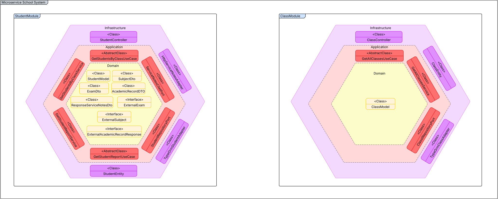
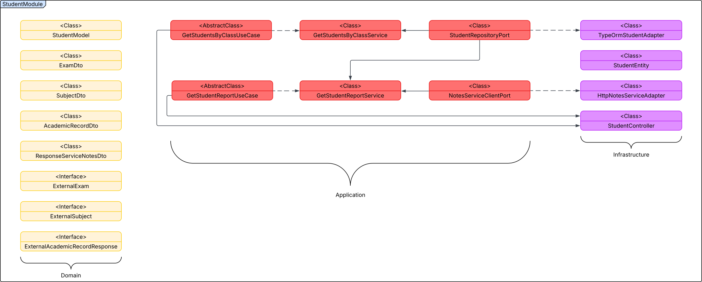
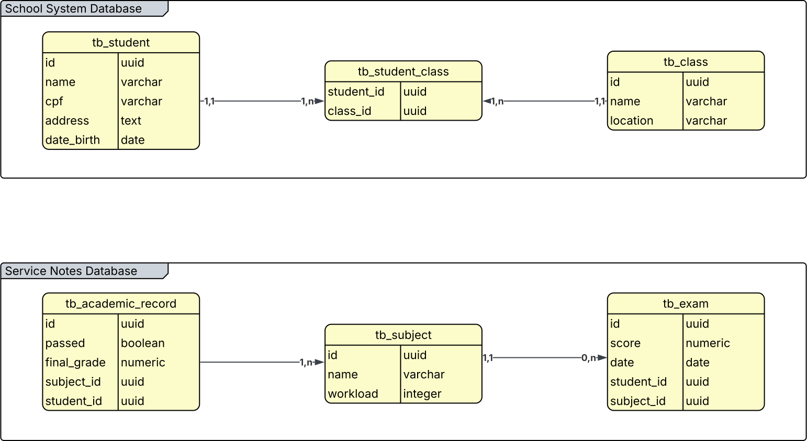
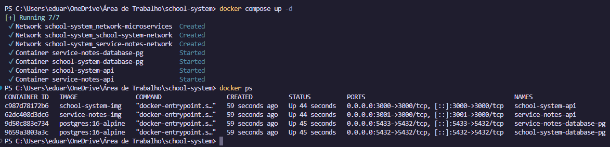
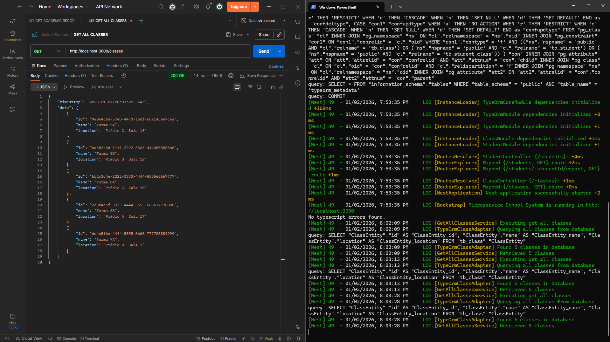
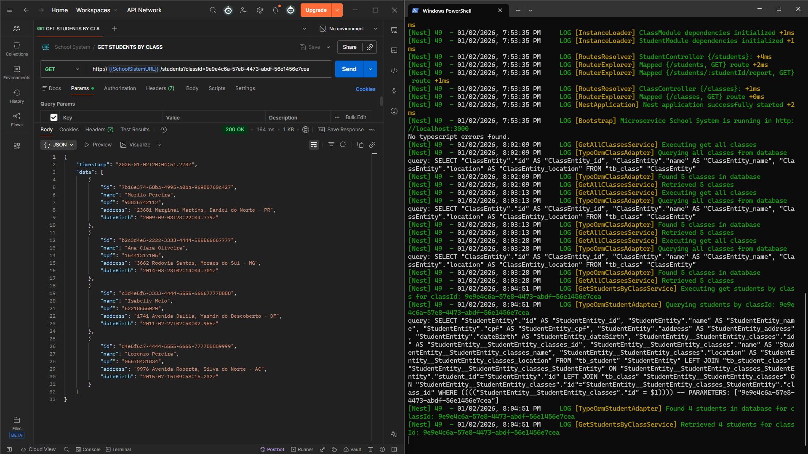
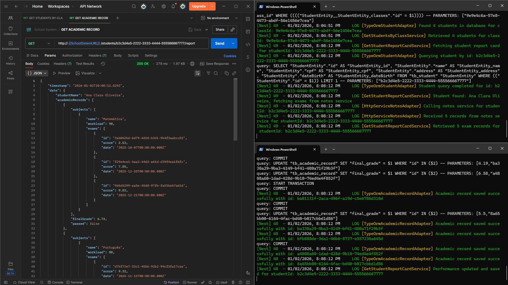

# Desafio Técnico Staloo

## Índice

1. [Tecnologias Utilizadas](#tecnologias-utilizadas)
2. [Arquitetura](#arquitetura)
3. [Pré-requisitos](#pré-requisitos)
4. [Configurações Iniciais](#configurações-iniciais)
5. [Executando a API](#executando-a-api)
6. [Testes](#testes)
7. [Capturas de tela](#capturas-de-tela)

## Tecnologias Utilizadas


## Arquitetura

### Microserviços

**OBS:** _A comunicação entre os microservices é realizada através de requisições HTTP_

A arquitetura aplicada no projeto foi a hexagonal, junto com a arquitetura modular no Nest.js.
Cada módulo é dividido em três camadas principais: **domain**, **application** e **infrastructure**


#### 1. Domain

Camada central da aplicação que contém as **regras de negócio** e **entidades**. É independente de frameworks, bancos de dados ou qualquer tecnologia externa.

```
student/
└── domain/
    ├── student.model.ts
    ├── dto/
    └── interfaces/
```

#### 2. Application

Camada que orquestra o fluxo da aplicação através de **casos de uso** e define **portas** para comunicação com o mundo externo.

- **Ports (in):** Classes abstratas que definem como a aplicação pode ser usada (casos de uso)
- **Ports (out):** Classes abstratas que definem como a aplicação se comunica com serviços externos
- **Services:** Implementação dos casos de uso

```
student/
└── application/
    ├── ports/
    │   ├── in/
    │   │   ├── get-student-report-card.use-case.ts
    │   │   └── get-students-by-class.use-case.ts
    │   └── out/
    │       ├── student.repository.port.ts
    │       └── service-notes-client.port.ts
    └── services/
        ├── get-student-report-card.service.ts
        └── get-students-by-class.service.ts
```

#### 3. Infrastructure

Camada que contém as **implementações concretas** das portas definidas na camada de aplicação. Aqui ficam os **adapters** que conectam a aplicação ao mundo externo.

- **Adapters (in):** Recebem requisições externas (controllers HTTP)
- **Adapters (out):** Comunicam com serviços externos (banco de dados, APIs)

```
student/
└── infrastructure/
    └── adapters/
        ├── in/
        │   └── web/
        │       └── student.controller.ts
        └── out/
            ├── persistence/
            │   ├── student.entity.ts
            │   └── typeorm-student.adapter.ts
            └── external/
                └── http-service-notes.adapter.ts
```

### Fluxo de dados

Para a implementação da arquitetura, é necessário criar providers personalizados. Eles permitem que realizemos a injeção de dependência das classes abstratas ou interfaces, seguindo o princípio de inversão de dependência.

No NestJS, configuramos isso em cada módulo. Exemplo do `student.module.ts`:

```
  providers: [
    { provide: GetStudentsByClassUseCase, useClass: GetStudentsByClassService },
    {
      provide: GetStudentReportCardUseCase,
      useClass: GetStudentReportCardService,
    },
    { provide: StudentRepositoryPort, useClass: TypeOrmStudentAdapter },
    { provide: ServiceNotesClientPort, useClass: HttpServiceNotesAdapter },
  ],
```

Definimos um token, e toda vez que esse token é injetado, a classe concreta é utilizada.



### Banco de Dados

Foi optado pela criação de um banco de dados para cada microserviço, tornando-os independentes.



Para acessar a documentação completa, [clique aqui](https://lucid.app/lucidchart/54d00639-0c33-460f-960b-964a0e616cc2/edit?viewport_loc=-3347%2C2637%2C7069%2C3432%2C0_0&invitationId=inv_c14fb5c8-ae9c-4b90-b1c3-7d1b5891be61).

## Pré-requisitos

Para executar este projeto, você precisará ter instalado:

- **Git**
- **Node.js 18+**
- **npm** ou **yarn**
- **Docker e Docker Compose**

## Configurações Iniciais

### 1. Clonando o Repositório

Clone o repositório executando o seguinte comando no terminal:

```bash
git clone https://github.com/deiz0n/teste-tecnico-staloo
cd teste-tecnico-staloo
```

### 2. Configurando as Variáveis de Ambiente

Crie um arquivo `.env` com base no arquivo `.env.example`:

```bash
cp .env.example .env
```

Preencha as variáveis conforme necessário:

```env
# Microservice School System
SCHOOL_SYSTEM_PORT=3000
SCHOOL_SYSTEM_DB_PORT=5432
SCHOOL_SYSTEM_DB_USER=dudu1
SCHOOL_SYSTEM_DB_PASSWORD=1234567

# Microservice Service Notes
SERVICE_NOTES_PORT=3001
SERVICE_NOTES_DB_PORT=5433
SERVICE_NOTES_DB_USER=dudu2
SERVICE_NOTES_DB_PASSWORD=1234567
```

**⚠️ IMPORTANTE:**

- Certifique-se de preencher todos os campos para garantir o correto funcionamento da API

## Executando a API

Executando com Docker Compose

Esta opção iniciará automaticamente os bancos de dados PostgreSQL e ambos os microserviços:

```bash
docker-compose up --build
```

### Endpoints disponíveis

```bash
# Lista todas as turmas
GET http:/localhost:${SCHOOL_SYSTEM_PORT}/classes

# Lista todos os alunos de uma turma
GET http://localhost:${SCHOOL_SYSTEM_PORT}/students?classId=${CLASS_ID}

# Gerar o boletim de um aluno
GET http://localhost:${SCHOOL_SYSTEM_PORT}/students/${STUDENT_ID}/report
```

### Populando o Banco de Dados (Seeds)

Para popular ambos os bancos com dados:

```bash
npm run seed:all
```

## Testes

```bash
# Executar testes unitários
npm run test

# Executar testes com watch mode
npm run test:watch

# Executar testes com cobertura
npm run test:cov
```

## Capturas de tela

### 1. Networks, microserviços e bancos de dados em execução



### 2. Listagem das turmas



### 3. Listagem dos alunos por turma



### 4. Geração do boletim


